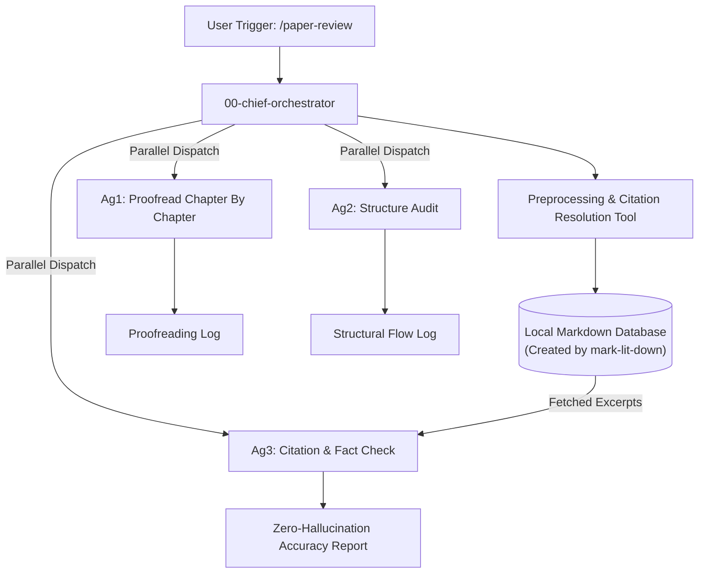

# academic-auto-reviewer

**A Multi-Agent, Zero-Hallucination Academic Review Ecosystem built on local Agentic RAG.**

`academic-auto-reviewer` is a cutting-edge, autonomous orchestration ecosystem designed for researchers. Instead of relying on a single LLM chat window that hallucinates citations or blindly agrees with your draft, this system coordinates multiple specialized AI agents to rigorously proofread, structurally critique, and fact-check your academic manuscripts against a localized literature database.

---

## The AI Cast

The ecosystem is coordinated by a central orchestrator who manages three specialized "workers":

### 👑 00-chief-orchestrator (The Commander)
The central nervous system of the workflow. She parses your `/paper-review` input, strips the manuscript of token-wasting noise (like images and tables), coordinates Python tools to map your citations, splits the document into chapters, and oversees the parallel dispatch of the worker agents.

### 📝 ag1-academic-proofread (The Linguist)
A bilingual specialist restricted to surface-level linguistic corrections. Fixes typos, enforces Oxford commas, corrects Chinese-English padding, and ensures typographic consistency without ever altering your meaning or phrasing.

### 🏗️ ag2-academic-structure (The Editor)
The senior structural editor. Evaluates argument flow, flags logical gaps, identifies redundant phrasing, and ensures macro-coherence across your Introduction, Methodology, and Conclusion.

### 🕵️ ag3-academic-factcheck (The Auditor)
A ruthlessly rigorous fact-checker built on [Natural Language Inference (NLI) constraints](https://en.wikipedia.org/wiki/Textual_entailment). It is physically isolated from web-search APIs. It cross-validates every factual claim in your draft **only** against the retrieved text from your verified local database, completely eliminating LLM citation hallucinations.

---

## Architecture Overview



> **For a deep dive into how the pipeline works, read the [WORKFLOW GUIDE](docs/WORKFLOW_GUIDE.md).**

---

## Prerequisites

To maintain a zero-hallucination guarantee, **this workflow cannot function without a local database of your literature.**

Before installing the reviewer, you must build your local database using the companion tool:
👉 **[mark-lit-down (Knowledge Base Engine)](https://github.com/yourusername/mark-lit-down)**

---

## Installation & Setup

1. **Install the framework**: Place this `.agent` folder at the root of your primary writing workspace.
2. **Configure Paths**: Ensure the python tools located in `.agent/skills/tools/` point to your local database generated by `mark-lit-down`.
3. **Run the Workflow**: In your AI agent terminal, use the trigger command:

```bash
/paper-review drafts/my_manuscript.md --voice third
```

## Contributing

The workflow is designed to be modular. You can seamlessly add new specialized agents to the `.agent/skills/` directory (e.g., a methodology-specific checker or a data-visualization advisor) and update the `00-chief-orchestrator`'s dispatch logic to include them.

## License

MIT License
