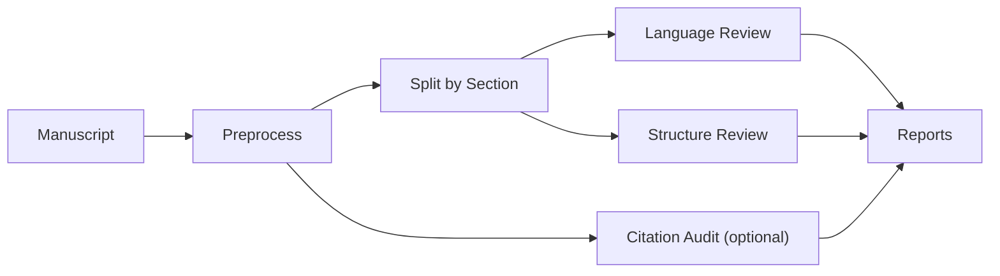

<div align="center">


# academic-auto-reviewer

*A local workflow for reviewing academic manuscripts: language, structure, and citation checks against your own literature base.*

**[English]** | [中文](README_zh.md)

</div>

`academic-auto-reviewer` is a manuscript review workflow for researchers who want a structured, local-first review before submission. It reviews a near-final draft, generates separate reports for language and structure, and can optionally audit citation-grounded claims against a local literature database.

## What It Does

- Reviews an academic manuscript without modifying the original file
- Generates separate reports for language issues, structural issues, and citation checks
- Uses a local literature database for grounded citation auditing
- Supports English and Chinese manuscripts

## Who It's For

This project is designed for:

- Researchers preparing a near-final draft for submission
- Users who prefer local, inspectable workflows
- Authors working in Markdown directly or converting from Word or LaTeX for AI-assisted review

This project is not currently designed for:

- Word-native in-place editing workflows
- PDF-first reading or annotation
- Fully hosted, zero-setup use cases

Markdown is the current working format for the review pipeline because it is easy to inspect, split, and process with AI agents. If your manuscript is in another format, converting it with `pandoc` is usually a low-friction step.

## Input and Output

| Input | Output |
|---|---|
| `my_manuscript.md` | `*_report_linguist.md` |
| optional local literature database | `*_report_architect.md` |
| optional citation / bibliography context | `*_report_auditor.md` |

The original manuscript is left unchanged.

## Quickstart

1. Prepare your manuscript in Markdown, or convert from Word / LaTeX with `pandoc`
2. Optionally prepare a local literature database for citation auditing
3. Run the review workflow in a supported agent runtime

Example:

```bash
/paper-review drafts/my_manuscript.md --voice third
```

Useful conversions:

```bash
pandoc my_manuscript.docx -o my_manuscript.md
pandoc my_manuscript.tex -o my_manuscript.md
```

## Workflow Overview



The workflow includes three review tracks:

- `linguist`: language and style issues
- `architect`: structure and argument flow
- `auditor`: citation-grounded claim checking

## Current Scope

- Input format: Markdown manuscripts used as the working review format
- Typical source formats: Markdown, Word, and LaTeX via conversion
- Review language: English and Chinese
- Citation audit backend: local literature database
- Current packaged runtime: [Antigravity](https://github.com/google/antigravity)
- Workflow design: modular and portable to other agent runtimes

If you only need language and structure review, the citation-audit step can be skipped.

## Why This Project

Many AI tools help researchers read papers, summarize sources, or answer questions. `academic-auto-reviewer` focuses on a different stage: reviewing your own manuscript before submission.

Its goal is to make draft review more systematic by separating three tasks that are often mixed together:

- language cleanup
- structural diagnosis
- evidence-grounded citation auditing

Rather than promising perfect verification, the workflow is designed to make claims easier to inspect, challenge, and revise using local evidence.

## Documentation

- [Workflow Guide](docs/WORKFLOW_GUIDE.md)
- [Chinese Workflow Guide](docs/WORKFLOW_GUIDE_zh.md)

## FAQ

### Do I need Antigravity?

No in principle. The workflow design is general. This release is currently packaged for Antigravity.

### Do I need a local literature database?

Only for citation auditing. Language and structure review can run without it.

### Does it modify my manuscript?

No. The workflow generates review reports and leaves the original manuscript unchanged.

### Can I use Word or LaTeX?

Yes. The current working format is Markdown, but converting from Word or LaTeX with `pandoc` is usually straightforward.

## License

Released under the [MIT License](LICENSE). Copyright &copy; 2026 Jidi Cao.

## Credits

- The planning logic draws on ideas from [planning-with-files](https://github.com/othmanadi/planning-with-files).
- The local literature workflow is designed to work well with [mark-lit-down](https://github.com/Jidi1997/mark-lit-down).
