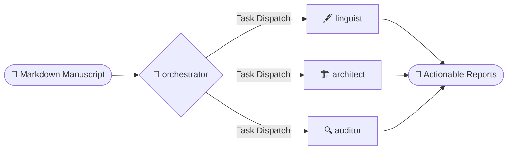

<div align="center">


# 📚 academic-auto-reviewer

<p align="center">
  
  
  
  
</p>

*A grounded, citation-traceable review pipeline built on local agentic RAG.*

**[English]** | [中文](README_zh.md)

</div>
> Most AI literature tools help you **read** papers. This one helps you **review** your own — cross-checked against thousands of references in your local library.
 
`academic-auto-reviewer` is an automated multi-agent review workflow built for researchers who demand more than a chatbot's opinion. It does not answer questions; it interrogates your manuscript. Three isolated specialist agents run in parallel across your entire literature base to simultaneously audit language, structure, and factual claims—eliminating hallucinated citations and confirmation bias by architectural design.

---

## Prerequisites 

Before deployment, ensure your environment meets the following requirements:
- **Environment**: Python 3.9+ and the [Antigravity](https://github.com/google/antigravity) agent framework.
- **Data Layer**: For empirical fact-checking, you must first construct a local knowledge base using the companion engine:
  👉 **[mark-lit-down (Knowledge Base Engine)](https://github.com/Jidi1997/mark-lit-down)**
- **File Format**: Currently supports academic manuscripts in `.md` (Markdown) format.

*(If you only need linguistic proofreading and structural analysis, the literature fact-check step can be skipped.)*

---

## Workflow Features

This project operates within the **Antigravity** agent environment, automating tedious manuscript review tasks while maintaining academic rigor.
- **Bilingual Support:** Fully capable of processing and reviewing manuscripts in both **English** and **Chinese**.
- **Input Processing:** The system ingests standard `.md` (Markdown) academic manuscripts.
- **Output:** Instead of silently altering your original text, it generates four specialized, actionable markdown reports highlighting structured feedback.



> **Not using Markdown?** 
> If your draft is in another format, use [`pandoc`](https://pandoc.org/) to quickly convert it before running the workflow:
> ```bash
> # Word (.docx) to Markdown
> pandoc my_manuscript.docx -o my_manuscript.md
> 
> # LaTeX (.tex) to Markdown
> pandoc my_manuscript.tex -o my_manuscript.md
> ```

---

## System Architecture & Agent Function

The review pipeline is coordinated by a central orchestrator dispatching parallel analysis tracks.

### orchestrator : Pipeline Coordinator
The coordination engine. Parses the manuscript, removes non-rhetorical noise (tables, formatting), routes citation data, and oversees parallel agent execution.

### linguist : Surface & Style Agent
A bilingual specialist focused on linguistic accuracy. Enforces typographic consistency and academic grammar (e.g., CJK-Latin spacing, punctuation rules) without altering original meaning.

### architect : Structural Coherence Agent
Evaluates argument flow and macro-coherence. Identifies logical gaps and redundant phrasing across the introduction, methodology, and conclusion.

### auditor : NLI Fact-Check Agent
Validates empirical claims using [Natural Language Inference (NLI)](https://en.wikipedia.org/wiki/Textual_entailment). Claims are cross-validated strictly against retrieved text from your verified local database.

### planner : Task Decomposition Core
Empowers the workflow to formulate, break down, track, and accomplish complex tasks. By mapping task progression in real-time, it ensures the entire review process remains transparent and controlled.

---

## Installation & Execution

1. **Deploy Framework**: Clone and place this `.agent` directory at the root of your primary writing workspace.
2. **Configure Database Paths**: Ensure that your local markdown database is correctly indexed within the agent's RAG skill (check `.agent/skills/ag3-academic-factcheck/SKILL.md` for path references).
3. **Execution**: Trigger the review within your IDE or agent terminal. **Ensure you are at the project root directory** before running the command:

```bash
/paper-review drafts/my_manuscript.md --voice third
```

*Note on Language Voice (`--voice`): You can align the proofreader to the chosen narrative perspective of your paper. Set this to `first` (e.g., "We examine..."), `second` (e.g., "You can see..."), or `third` (e.g., "This study examines...") to ensure consistent tone across the manuscript.*

> **For a deep dive into how the pipeline works, read the [WORKFLOW GUIDE](docs/WORKFLOW_GUIDE.md).**

---

## Output Reports

Upon completion, your original manuscript remains unmodified. The system synthesizes three actionable reports:
- `[Proofreading Log]` — Detailed map of linguistic corrections and typographic consistency checks.
- `[Structural Flow Log]` — Analysis of argumentative coherence and transitions between sections.
- `[Fact-Check Validation Report]` — Verification results of empirical claims against your local database. 

---

## Why `academic-auto-reviewer`?

| | Standard RAG | NotebookLM | Zotero Plugins | **This project** |
|:--|:--:|:--:|:--:|:--:|
| **Interaction model** | Q&A on demand | Summarise & chat | Sidebar assist | Autonomous manuscript audit |
| **Fact validation** | Probabilistic generation | Source-anchored chat | Single-document context | NLI-based claim verification |
| **Literature source** | Cloud retrieval | Fixed upload set | Per-file or folder | Full Zotero library, locally indexed |
| **Agent architecture** | Single-turn | Closed black-box | Lightweight plugin | Parallel specialist agents |
| **Output** | Free-form text reply | Notes & summaries | Inline annotations | Structured review report set |
| **Privacy** | Cloud-dependent | Google-hosted | Desktop-local | Fully local — no data leaves your machine |
| **Customisable rules** | Prompt only | None | None | Editable skills per discipline |

### The Core Distinction
 
Most AI literature tools solve the **read** problem — helping you consume and understand existing papers.  
`academic-auto-reviewer` solves the **review** problem — auditing what *you* have written against your verified literature base.

Even for ultra-large manuscripts with hundreds to thousands of citations, the multi-agent parallel mechanism enables a one-time, fully automated deep analysis and verification.

#### vs. Standard RAG (Kimi, Poe, LangChain pipelines)
These systems are built around a passive assumption: the user knows what to ask. They retrieve, then generate — and if your manuscript contains a wrong claim, they will often contextualize it rather than challenge it. This project inverts the flow: it interrogates your manuscript without waiting for a question.

#### vs. NotebookLM
NotebookLM anchors responses to uploaded sources, which reduces hallucination in Q&A. But it has no concept of *auditing a draft*. It will not tell you that line 14 of your manuscript contradicts Smith (2021), because it was never asked to look. The `auditor` agent here uses NLI inference — every empirical claim is tested for `SUPPORTED / CONTRADICTED / NEUTRAL` against retrieved evidence, not generated from model memory. Additionally, NotebookLM is Google-hosted and closed: you cannot inspect or modify its review logic. Every prompt and skill in this project lives on your local filesystem.

#### vs. Zotero Plugins (ZotGPT, Zotero Connector + GPT)
Plugin-based tools are tightly coupled to the Zotero desktop client and operate on one paper at a time. `mark-lit-down` decouples the data layer entirely — your Zotero library is converted into a portable, version-controllable Markdown database that any downstream pipeline can consume. The review agents then operate across your *entire* literature base in parallel, not against a single open tab.

---

> **Note**: This workflow is designed for researchers comfortable with command-line tools and a Markdown-based writing environment. If your draft lives in Word or Google Docs, convert it first with [`pandoc`](https://pandoc.org/).

---

## License & Credits

Released under the [MIT License](LICENSE). Copyright &copy; 2025–2026 Jidi Cao.

### Credits
- The Task Planning logic is adapted from the [othmanadi/planning-with-files](https://github.com/othmanadi/planning-with-files) framework.
- Researchers are encouraged to integrate new specialist agents into the `.agent/skills/` directory and update the `orchestrator` dispatch protocol.
