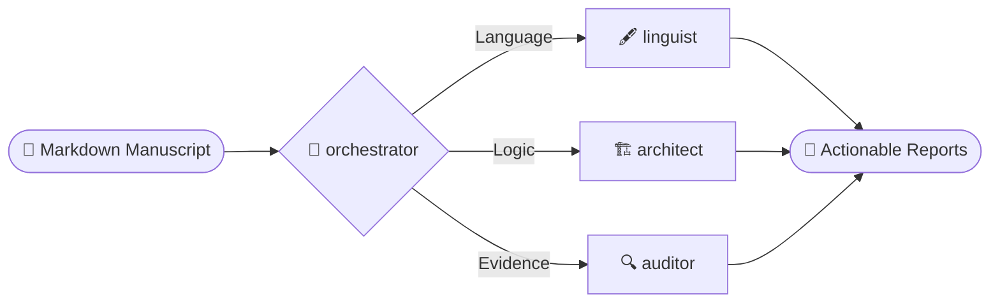

<div align="center">


# 📚 academic-auto-reviewer

<p align="center">
  
  
  
  
</p>

*A grounded, citation-traceable review pipeline built on local agentic RAG.*

**[English]** | [中文](README_zh.md)

</div>

`academic-auto-reviewer` provides an orchestration pipeline designed strictly for researchers. By moving away from standard, single-chat LLM interactions—which are prone to hallucinated citations and unchecked confirmation bias—this ecosystem leverages multiple specialized AI agents. It rigorously audits, structurally critiques, and fact-checks academic manuscripts against a locally verified literature database.

---

## Evidence-Based Review Pipeline

Every factual claim is validated against your local literature database, not generated from model memory. This ensures a grounded, citation-traceable review process. 

Prior to execution, your local database must be constructed using the companion engine if you need a literature fact-check:
👉 **[mark-lit-down (Knowledge Base Engine)](https://github.com/Jidi1997/mark-lit-down)**

*(If you only need linguistic proofreading and structural analysis, the literature fact-check step can be skipped.)*

---

## Workflow Features

This project operates within the **Antigravity** agent environment, automating tedious manuscript review tasks while maintaining academic rigor.
- **Bilingual Support:** Fully capable of processing and reviewing manuscripts in both **English** and **Chinese**.
- **Input Processing:** The system ingests standard `.md` (Markdown) academic manuscripts.
- **Output:** Instead of silently altering your original text, it generates four specialized, actionable markdown reports highlighting structured feedback.



> **Not using Markdown?** 
> If your draft is in another format, use [`pandoc`](https://pandoc.org/) to quickly convert it before running the workflow:
> ```bash
> # Word (.docx) to Markdown
> pandoc my_manuscript.docx -o my_manuscript.md
> 
> # LaTeX (.tex) to Markdown
> pandoc my_manuscript.tex -o my_manuscript.md
> ```

---

## System Architecture & Agent Function

The review pipeline is coordinated by a central orchestrator dispatching parallel analysis tracks.

### orchestrator : Pipeline Coordinator
The coordination engine. Parses the manuscript, removes non-rhetorical noise (tables, formatting), routes citation data, and oversees parallel agent execution.

### linguist : Surface & Style Agent
A bilingual specialist focused on linguistic accuracy. Enforces typographic consistency and academic grammar (e.g., CJK-Latin spacing, punctuation rules) without altering original meaning.

### architect : Structural Coherence Agent
Evaluates argument flow and macro-coherence. Identifies logical gaps and redundant phrasing across the introduction, methodology, and conclusion.

### auditor : NLI Fact-Check Agent
Validates empirical claims using [Natural Language Inference (NLI)](https://en.wikipedia.org/wiki/Textual_entailment). Claims are cross-validated strictly against retrieved text from your verified local database.

### planner : Task Decomposition Core
Empowers the workflow to formulate, break down, track, and accomplish complex tasks. By enforcing the creation of `_plan.md` and `_status.md` files, it maps task progression to the local filesystem for transparency.
*(Methodology adapted from the [othmanadi/planning-with-files](https://github.com/othmanadi/planning-with-files) framework).*

---

## Installation & Execution

1. **Deploy Framework**: Clone and place this `.agent` directory at the root of your primary writing workspace.
2. **Configure Database Paths**: Ensure that your local markdown database is correctly indexed within the agent's RAG skill (check `.agent/skills/ag3-academic-factcheck/SKILL.md` for path references).
3. **Execute**: Trigger the review within your IDE or agent terminal.

```bash
/paper-review drafts/my_manuscript.md --voice third
```

*Note on Language Voice (`--voice`): You can align the proofreader to the chosen narrative perspective of your paper. Set this to `first` (e.g., "We examine..."), `second` (e.g., "You can see..."), or `third` (e.g., "This study examines...") to ensure consistent tone across the manuscript.*

> **For a deep dive into how the pipeline works, read the [WORKFLOW GUIDE](docs/WORKFLOW_GUIDE.md).**

---

## Output Reports

Upon completion, your original manuscript remains unmodified. The system synthesizes three actionable reports:
- `[Proofreading Log]` — Detailed map of linguistic corrections and typographic consistency checks.
- `[Structural Flow Log]` — Analysis of argumentative coherence and transitions between sections.
- `[Fact-Check Validation Report]` — Verification results of empirical claims against your local database. 

---

## License & Contribution

Released under the [MIT License](LICENSE). Copyright &copy; 2026 Jidi Cao.

This ecosystem is highly modular. Researchers are encouraged to integrate new specialist agents (e.g., methodology validators or data-visualization advisors) into the `.agent/skills/` directory and update the `00-chief-orchestrator` dispatch protocol.
