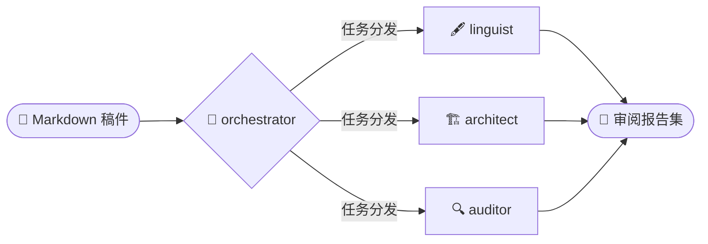

<div align="center">
 

 
# 📚 academic-auto-reviewer
 
<p align="center">
  
  
  
  
</p>

*基于本地代理化 RAG 架构、立足证据且引用可追溯的多代理审阅工作流。*

[English](README.md) | **[中文]**

</div>

> 大多数 AI 文献工具辅助你**阅读**论文，而本项目致力于**审阅**你的研究输出——基于本地库中数千篇真实文献，逐条核实你的每一句论断。
 
`academic-auto-reviewer` 是一套面向研究者的自动化多代理审阅工作流。它不只是被动地回答问题，而是主动质询你的手稿。通过三个相互隔离的专业代理并行协作，系统在你的完整本地文献库上同步展开语言校对、结构评议与事实核查，从架构层面杜绝引用幻觉与事实偏差。

---

## 配置条件 (Prerequisites)

在开始安装之前，请确保您的环境满足以下条件：
- **运行环境**：Python 3.9+ 及 [Antigravity](https://github.com/google/antigravity) 代理框架。
- **数据基础**：如需执行实证核查，必须先使用配套引擎构建本地文献库：
  👉 **[mark-lit-down (知识库构建引擎)](https://github.com/Jidi1997/mark-lit-down)**
- **文件格式**：目前仅支持 `.md` (Markdown) 格式的学术稿件。

*(如果您仅需要语言润色和结构分析，可以跳过文献事实核查步骤。)*

---

## 工作流特性

本项目运行于 **Antigravity** 代理环境，在保持学术严谨性的同时，自动化处理繁琐的论文审阅任务。
- **双语支持：** 全面支持 **英文** 和 **中文** 学术稿件的交叉审阅。
- **过程透明：** 每一个审阅动作都记录在 `_plan.md` 和 `_status.md` 过程日志中，确保任务执行轨迹可追溯。
- **非侵入式输出：** 系统不会直接修改您的原生文档，而是生成三份专业、可操作的 Markdown 评估报告。



> **不是 Markdown 格式？**
> 如果您的初稿是其他格式（如 Word 或 LaTeX），请在运行工作流前使用 [`pandoc`](https://pandoc.org/) 进行快速转换：
> ```bash
> # Word (.docx) 转 Markdown
> pandoc my_manuscript.docx -o my_manuscript.md
> 
> # LaTeX (.tex) 转 Markdown
> pandoc my_manuscript.tex -o my_manuscript.md
> ```

---

## 系统架构与代理职能

整个审阅管线由中心调度器 (Orchestrator) 协调，并分发给多个并行的分析轨道。

### orchestrator : 管线调度器
核心协调引擎。负责解析稿件、去除格式噪声、分发引用数据，并监督各代理的并行执行。

### linguist : 语言与风格代理
精通双语的专家代理，专注于语言准确性。在不改变原意的前提下，强制执行排版一致性和学术语法规范（如中英文混排空格、标点规则等）。

### architect : 结构连贯性代理
评估论证流和宏观逻辑。识别摘要、引言、方法论及结论部分存在的逻辑断层或冗余表达。

### auditor : NLI 事实核查代理
利用 [自然语言推理 (NLI)](https://zh.wikipedia.org/wiki/文本蕴涵) 技术验证实证陈述。所有陈述必须严谨地通过本地数据库检索到的原文内容进行交叉验证。

### planner : 任务拆解核心
赋予工作流制定、拆解、跟踪和完成复杂任务的能力。通过实时映射任务进度，确保整个审阅过程透明、可控。

---

## 安装与执行

1. **部署框架**：克隆并将此 `.agent` 目录放置在您的论文写作工作区的根目录下。
2. **配置数据库路径**：确保您的本地 Markdown 数据库已在代理的 RAG 技能中正确索引（详见 `.agent/skills/auditor/SKILL.md` 中的路径引用）。
3. **执行指令**：在您的 IDE 环境或 Antigravity 终端中，**进入项目根目录**并运行以下命令：

```bash
/paper-review drafts/my_manuscript.md --voice third
```

*关于语称 (`--voice`)：您可以根据论文的叙述人称调整润色风格。可选值为 `first` (如 "We examine..." / "本研究考察了...")、`second` (如 "You can see..." / "可以看到...") 或 `third` (如 "This study examines..." / "本研究发现...")，以确保全文色调统一。*

> **如需深入了解工作流运行机制，请阅读 [工作流指南 (中文版)](docs/WORKFLOW_GUIDE_zh.md)。**

---

## 输出报告 (Output Reports)

审阅完成后，您的原始初稿将保持不变。系统会生成以下三份报告：
- `[Proofreading Log]` — 语言修改建议与排版一致性核查明细。
- `[Structural Flow Log]` — 论证连贯性分析及各章节衔接评估。
- `[Fact-Check Validation Report]` — 基于本地数据库的事实核查结果。

---

## 为什么选择 `academic-auto-reviewer`？

| | 标准 RAG | NotebookLM | Zotero 插件类 | **本项目** |
|:--|:--:|:--:|:--:|:--:|
| **交互模式** | 按需问答 | 摘要与对话 | 侧边栏辅助 | 手稿自动审计 |
| **事实验证** | 概率化生成 (易幻觉) | 锚定源的对话 | 基于单一文件 | 基于 NLI 的断言核对 |
| **文献来源** | 云端检索 | 有限的文件集 | 单篇文件或目录 | 全量 Zotero 库，本地索引 |
| **代理架构** | 单次交互 | 封闭式黑盒 | 轻量化插件 | 多代理并行调度 |
| **输出结果** | 自由文本回复 | 笔记与摘要 | 行间标注 | 结构化审阅报告集 |
| **隐私性** | 依赖云端 | Google 托管 | 桌面本地运行 | 完全本地 — 数据不出本地 |
| **规则定制** | 仅限 Prompt | 无 | 无 | 不同学科可编辑技能 |

### 核心区别 (The Core Distinction)

目前市面上大多数 AI 文献工具解决的是 **“读” (Read)** 的问题 —— 帮助您摄入并理解现有的论文。  
而 `academic-auto-reviewer` 解决的是 **“审” (Review)** 的问题 —— 根据您验证过的文献库，审计**您自己**写下的每一行文字。

即便面对包含数百至上千篇文献引用的超大型手稿，也能通过多代理并行机制，实现一次性、全自动的深度分析与查证。

#### vs. 标准 RAG (如 Kimi, Poe, LangChain 管线等)
这类系统通常基于一个被动的假设：用户知道该问什么。它们先检索、后生成。如果您提交的手稿中包含了错误的陈述，它们往往会顺着您的上下文进行润色，而不是对其提出挑战。本项目则反其道而行之：它在不等待用户提问的情况下，主动质询您的手稿。

#### vs. NotebookLM
NotebookLM 将回答锚定在上传的资源上，这减少了问答中的幻觉。但它没有“审计初稿”的概念。它不会告诉您手稿的第 14 行与 Smith (2021) 的发现相矛盾，因为它从未被要求去寻找这种矛盾。本项目的 `auditor` 代理采用 NLI 推理 —— 每一项实证陈述都会针对检索到的证据进行 `SUPPORTED / CONTRADICTED / NEUTRAL` 的测试，而不是从模型记忆中生成判断。此外，NotebookLM 是闭源且托管在 Google 云端的，您无法查看或修改其审阅逻辑。

#### vs. Zotero 插件 (如 ZotGPT, Zotero Connector + GPT 等)
插件类工具通常与 Zotero 桌面端强绑定，且一次只能处理一篇论文。`mark-lit-down` 彻底实现了数据层与工具层的解耦 —— 您的 Zotero 库被转化为便携、可版本控制的 Markdown 数据库，任何下游管线都可以调用。审阅代理随后会对您的**整个**文献库进行并行操作，而非仅针对单个打开的标签页。

---

> **注意**：本工作流专为习惯使用命令行工具、偏好 Markdown 写作环境的研究者设计。如果您的初稿在 Word 或 Google Docs 中，请先使用 [`pandoc`](https://pandoc.org/) 进行转换。

---

## 许可与致谢

本项目基于 [MIT 许可协议](LICENSE) 发布。版权所有 &copy; 2025–2026 Jidi Cao。

### 致谢
- 本工作流的 Planner 模块核心方法论参考自 [othmanadi/planning-with-files](https://github.com/othmanadi/planning-with-files) 框架。
- 系统采用高度模块化设计，诚邀研究者在 `.agent/skills/` 目录中集成新的专家代理，并更新 `orchestrator` 的调度协议。
