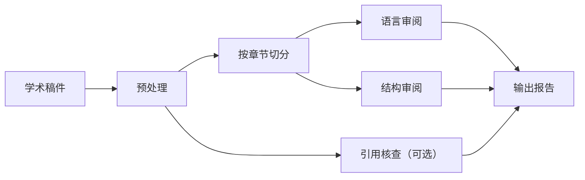

<div align="center">


# academic-auto-reviewer

*一套面向研究者的本地化学术审阅工作流：检查语言、结构，并基于你的文献库核对引用。*

[English](README.md) | **[中文]**

</div>

`academic-auto-reviewer` 是一套面向研究者的稿件审阅工作流，适用于投稿前的结构化自检。它面向接近定稿的学术手稿，输出独立的语言、结构和引用核查报告；其中引用核查模块可选接入本地文献库，以提供更可追溯的证据支持。

## 它能做什么

- 对学术稿件进行系统化审阅，不直接修改原稿
- 分别生成语言问题、结构问题、引用核查三类报告
- 可基于本地文献库进行引用与论断核对
- 支持英文和中文稿件

## 适合谁

这个项目适合：

- 正在准备投稿、希望在提交前做系统化自检的研究者
- 偏好本地、可检查、可控工作流的用户
- 直接使用 Markdown 写作，或愿意先从 Word / LaTeX 转换后再进行 AI 协作审阅的作者

这个项目目前不主要面向：

- 直接在 Word 中原位修改的编辑流程
- 以 PDF 阅读和批注为核心的使用场景
- 零配置、纯托管式的在线使用方式

Markdown 是当前工作流的协作格式，因为它更适合被 AI agent 拆分、检查和处理。如果你的稿件来自 Word 或 LaTeX，先通过 `pandoc` 转换通常不会带来太大阻力。

## 输入与输出

| 输入 | 输出 |
|---|---|
| `my_manuscript.md` | `*_report_linguist.md` |
| 可选的本地文献库 | `*_report_architect.md` |
| 可选的引用 / 书目信息 | `*_report_auditor.md` |

原始稿件文件保持不变。

## 快速开始

1. 准备 Markdown 格式的学术稿件，或先从 Word / LaTeX 转换
2. 如需引用核查，准备本地文献库
3. 在支持的 agent 运行环境中执行工作流

示例：

```bash
/paper-review drafts/my_manuscript.md --voice third
```

常见转换方式：

```bash
pandoc my_manuscript.docx -o my_manuscript.md
pandoc my_manuscript.tex -o my_manuscript.md
```

## 工作流概览



整个工作流包含三个审阅轨道：

- `linguist`：语言与表达问题
- `architect`：结构与论证流问题
- `auditor`：基于文献证据的引用核查

## 当前范围

- 输入格式：Markdown 作为当前工作流的处理格式
- 常见来源格式：Markdown、Word 和 LaTeX，经转换后进入流程
- 审阅语言：英文与中文
- 引用核查后端：本地文献库
- 当前打包运行时：[Antigravity](https://github.com/google/antigravity)
- 工作流设计：模块化，可迁移到其他 agent runtime

如果你只需要语言和结构审阅，可以跳过引用核查步骤。

## 为什么做这个项目

很多 AI 工具擅长帮助研究者读文献、做摘要或回答问题。`academic-auto-reviewer` 关注的是另一个阶段：在投稿前审阅你自己的手稿。

这个工作流试图把常常混在一起的三类任务拆开处理：

- 语言清理
- 结构诊断
- 基于证据的引用核查

它的目标不是承诺“绝对不会误判”，而是让稿件中的论断更容易被检查、质疑和修正，并尽量把判断建立在本地证据之上。

## 文档

- [Workflow Guide](docs/WORKFLOW_GUIDE.md)
- [工作流说明（中文）](docs/WORKFLOW_GUIDE_zh.md)

## 常见问题

### 必须使用 Antigravity 吗？

原则上不必须。这套工作流设计本身是通用的；当前 release 版本只是优先以 Antigravity 形式打包。

### 必须准备本地文献库吗？

只有在需要引用核查时才需要。语言和结构审阅可以单独运行。

### 它会直接修改原稿吗？

不会。工作流会输出审阅报告，原始稿件保持不变。

### 可以处理 Word 或 LaTeX 吗？

可以。当前工作流的处理格式是 Markdown，但你完全可以先用 `pandoc` 等工具把 Word 或 LaTeX 转换后再运行。

## 许可

本项目基于 [MIT License](LICENSE) 发布。版权所有 &copy; 2026 Jidi Cao。

## 致谢

- 任务规划部分参考了 [planning-with-files](https://github.com/othmanadi/planning-with-files) 的思路。
- 本地文献工作流可与 [mark-lit-down](https://github.com/Jidi1997/mark-lit-down) 配合使用。
