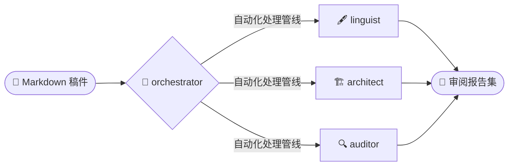

<div align="center">
 

 
# 📚 academic-auto-reviewer
 
<p align="center">
  
  
  
  
</p>

*基于本地代理化 RAG 架构、立足证据且引用可追溯的多代理审阅工作流。*

[English](README.md) | **[中文]**

</div>

`academic-auto-reviewer` 是一款面向研究者的**多代理审阅工作流**。通过多个专业化 AI 代理的协同调度，本系统能够根据本地验证过、高可信的文献数据库，对学术初稿（如投稿前的自查）进行严谨的实证审计、结构评议和事实核查，有效规避传统 LLM 交互中的引用幻觉和证实偏差。

---

## 前提条件 (Prerequisites)

在开始安装之前，请确保您的环境满足以下条件：
- **运行环境**：Python 3.9+ 及 [Antigravity](https://github.com/google/antigravity) 代理框架。
- **数据基础**：如需执行实证核查，必须先使用配套引擎构建本地文献库：
  👉 **[mark-lit-down (知识库构建引擎)](https://github.com/Jidi1997/mark-lit-down)**
- **文件格式**：目前仅支持 `.md` (Markdown) 格式的学术稿件。

*(如果您仅需要语言润色和结构分析，可以跳过文献事实核查步骤。)*

---

## 工作流特性

本项目运行于 **Antigravity** 代理环境，在保持学术严谨性的同时，自动化处理繁琐的论文审阅任务。
- **双语支持：** 全面支持 **英文** 和 **中文** 学术稿件的交叉审阅。
- **过程透明：** 每一个审阅动作都记录在 `_plan.md` 和 `_status.md` 过程日志中，确保任务执行轨迹可追溯。
- **非侵入式输出：** 系统不会直接修改您的原生文档，而是生成三份专业、可操作的 Markdown 评估报告。



> **不是 Markdown 格式？**
> 如果您的初稿是其他格式（如 Word 或 LaTeX），请在运行工作流前使用 [`pandoc`](https://pandoc.org/) 进行快速转换：
> ```bash
> # Word (.docx) 转 Markdown
> pandoc my_manuscript.docx -o my_manuscript.md
> 
> # LaTeX (.tex) 转 Markdown
> pandoc my_manuscript.tex -o my_manuscript.md
> ```

---

## 系统架构与代理职能

整个审阅管线由中心调度器 (Orchestrator) 协调，并分发给多个并行的分析轨道。

### orchestrator : 管线调度器
核心协调引擎。负责解析稿件、去除格式噪声、分发引用数据，并监督各代理的并行执行。

### linguist : 语言与风格代理
精通双语的专家代理，专注于语言准确性。在不改变原意的前提下，强制执行排版一致性和学术语法规范（如中英文混排空格、标点规则等）。

### architect : 结构连贯性代理
评估论证流和宏观逻辑。识别摘要、引言、方法论及结论部分存在的逻辑断层或冗余表达。

### auditor : NLI 事实核查代理
利用 [自然语言推理 (NLI)](https://zh.wikipedia.org/wiki/文本蕴涵) 技术验证实证陈述。所有陈述必须严谨地通过本地数据库检索到的原文内容进行交叉验证。

### planner : 任务拆解核心
赋予工作流制定、拆解、跟踪和完成复杂任务的能力。通过实时映射任务进度，确保整个审阅过程透明、可控。

---

## 安装与执行

1. **部署框架**：克隆并将此 `.agent` 目录放置在您的论文写作工作区的根目录下。
2. **配置数据库路径**：确保您的本地 Markdown 数据库已在代理的 RAG 技能中正确索引（详见 `.agent/skills/auditor/SKILL.md` 中的路径引用）。
3. **执行指令**：在您的 IDE 环境或 Antigravity 终端中，**进入项目根目录**并运行以下命令：

```bash
/paper-review drafts/my_manuscript.md --voice third
```

*关于语称 (`--voice`)：您可以根据论文的叙述人称调整润色风格。可选值为 `first` (如 "We examine..." / "本研究考察了...")、`second` (如 "You can see..." / "可以看到...") 或 `third` (如 "This study examines..." / "本研究发现...")，以确保全文色调统一。*

> **如需深入了解工作流运行机制，请阅读 [工作流指南 (中文版)](docs/WORKFLOW_GUIDE_zh.md)。**

---

## 输出报告 (Output Reports)

审阅完成后，您的原始初稿将保持不变。系统会生成以下三份报告：
- `[Proofreading Log]` — 语言修改建议与排版一致性核查明细。
- `[Structural Flow Log]` — 论证连贯性分析及各章节衔接评估。
- `[Fact-Check Validation Report]` — 基于本地数据库的事实核查结果。

---

## 许可与致谢

本项目基于 [MIT 许可协议](LICENSE) 发布。版权所有 &copy; 2025–2026 Jidi Cao。

### 致谢
- 本工作流的 Planner 模块核心方法论参考自 [othmanadi/planning-with-files](https://github.com/othmanadi/planning-with-files) 框架。
- 系统采用高度模块化设计，诚邀研究者在 `.agent/skills/` 目录中集成新的专家代理，并更新 `orchestrator` 的调度协议。
